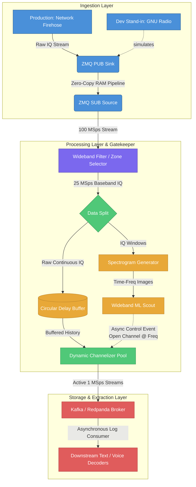

## 1. Architecture

> **Definition Note:** `MSps` (Mega-samples per second) and `kSps` (kilo-samples per second) refer to complex IQ sample rates. When using GNU Radio as the dev stand-in, these correspond directly to the `samp_rate` variable in GR blocks.

---

## 2. Stage 1: Ingestion & Transport

> **Environment Note:** GNU Radio is used here as a **development stand-in only**. Production does not use GNU Radio — the real data source is a live network firehose that feeds IQ frames directly into the ZMQ PUB socket. GNU Radio lets interns generate, replay, or import IQ data locally without needing access to production hardware.

ZMQ sits at the boundary between whatever produces IQ data and everything downstream. This is intentional: because the ZMQ socket interface is identical regardless of source, the entire processing pipeline is source-agnostic. Swapping GNU Radio for the production firehose requires zero changes to any downstream stage.

ZMQ was selected over custom bridge code after benchmarking. GNU Radio ships native ZMQ PUB/SUB sink and source blocks, meaning no custom integration is needed on the capture side. Any custom IPC solution would need to match ZMQ's throughput, be maintained, and be re-validated on every GNU Radio upgrade — ZMQ's built-in blocks eliminate that burden entirely.

### Implementation Tools
* **ZMQ PUB/SUB:** A publish-subscribe messaging pattern. The source publishes a continuous stream of IQ frames; the downstream consumer subscribes and receives them without the producer needing to know anything about who is listening.
* **Transport:** Use `ipc://` (named pipe) rather than `tcp://localhost` for same-machine deployments — it avoids the TCP stack and reduces latency meaningfully at high sample rates.

### Design Decisions

> **Pre-ZMQ: UDP Packet Loss**
> The production network firehose runs over UDP, which is connectionless and has no retransmission. Packet loss happens at the network layer before IQ data ever reaches ZMQ — and it is not uniform. Under congestion, losses are bursty, meaning multiple consecutive packets can drop together, punching a multi-millisecond hole in the sample timeline.
>
> This is more damaging than a ZMQ drop: a missing UDP packet creates a **gap in the continuous IQ stream**. Downstream blocks — PLLs, Costas loops, correlators, the PFB channelizer — all assume a contiguous sample sequence. An unannounced gap causes phase discontinuities and corrupts demodulation state until the block re-locks. The system will not crash; it will silently produce wrong output.
>
> Consider: How do you detect that a gap occurred? Common approaches include sequence numbers embedded in the IQ framing, hardware timestamps, or overflow indicators from the capture interface. Once a gap is detected, should you insert zero-filled samples to maintain sample count integrity, or flag and discard the affected window entirely? How does your answer change depending on which downstream consumer is looking at the data?

> **ZMQ Back-pressure & Drop Policy**
> ZMQ PUB/SUB is *lossy by design* — if the subscriber falls behind, the socket will silently drop frames once its internal high-water mark (HWM) is reached. At 100 MSps this can happen quickly and without any error or warning in the logs. This is a second, independent loss point stacked on top of the UDP loss above.
>
> Consider: What is the acceptable drop rate for your use case? Would you switch to ZMQ PUSH/PULL (which blocks the sender instead of dropping) for guaranteed delivery, and what does that mean for the upstream source when it stalls? How would you measure and alert on drop events before they become a silent data quality problem?

---

## 3. Stage 2: Wideband Filter (The "Zone" Selector)

Based on the specific operational use case of a target signal, the overall spectrum range is bounded to an expected neighborhood. This stage isolates that specific window and immediately reduces the primary data rate before it hits core memory-bound applications.

### Implementation Tools
* **Freq Xlating FIR Filter (Frequency Translating FIR Filter):** Performed in a single, computationally optimized mathematical step. It shifts the center frequency of the target "zone" down to baseband ($0\text{ Hz}$), applies a low-pass filter to discard adjacent spectral noise, and downsamples the data stream.

### Structural Parameters
* **Input Sample Rate:** $100\text{ MSps}$
* **Decimation Factor ($D_1$):** $4$
* **Output Sample Rate:** $25\text{ MSps}$

### Design Decisions

> **Static Zone vs. Dynamic Retuning**
> The zone center frequency and bandwidth are currently fixed parameters. This works well if your target is always in a known spectral neighborhood.
>
> Consider: What happens if the target signal hops outside the configured zone? Could the wideband ML scout (Stage 4) feed retune commands back to this stage, and what would that feedback loop look like? What are the risks of retuning mid-stream?

---

## 4. Stage 3: Narrowband Channelizer (The Channelized Slicer)

This stage splits the wideband "zone" into a parallel grid of low-rate streams. By dropping the sample rate down to the absolute Nyquist limit of the target signal, downstream classical DSP or machine learning inference can be performed without exhausting host hardware resources.

### Implementation Tools
* **PFB Channelizer (Polyphase Filterbank):** Utilizes a highly efficient combination of an FIR prototype filter and a Fast Fourier Transform (FFT) matrix to separate and decimate $N$ channels simultaneously with minimal CPU overhead.

### Advantages
* **Computational Relief (Multi-Stage Gain):** Isolating a $1\text{ MSps}$ channel straight out of a $100\text{ MSps}$ stream in one step requires a filter with thousands of taps to achieve a steep transition band. Splitting the decimation into two discrete steps ($\text{Stage 1 } [D=4] \rightarrow \text{Stage 2 } [D=25]$) radically reduces total filter tap coefficients and saves billions of CPU floating-point operations per second.
* **Channel Overlap (Data Integrity):** Physical digital filters lack perfect "brick wall" boundaries and suffer from signal attenuation at their edges (transition bands). The PFB is configured to intentionally overlap adjacent channel windows (typically by 25% to 50%). If a dynamic frequency hopper lands directly on a channel boundary, its energy is perfectly preserved in the main lobe of the adjacent channel.
* **Linear Scale Decimation Math:** Multi-stage decimation behaves multiplicatively:
  $$\text{Total Decimation } (D_{\text{total}}) = D_{\text{stage1}} \times D_{\text{stage2}} = 4 \times 25 = 100$$
  The final consumption application processes exactly $\frac{1}{100\text{th}}$ of the hardware's firehose rate.

### Structural Parameters
* **Input Sample Rate:** $25\text{ MSps}$
* **Decimation Factor ($D_2$):** $25$
* **Output Sample Rate:** $1\text{ MSps}$ per parallel channel stream

### Design Decisions

> **Always-On Channels vs. On-Demand Pool**
> A standard PFB with $D_2 = 25$ produces exactly 25 always-active output channels. An on-demand pool only activates a channel when the ML scout triggers it, saving CPU and memory — but adds startup latency.
>
> Consider: How does your choice here interact with the circular delay buffer? If channels are spawned on-demand, can the buffer feed *historical* IQ data into a newly opened channel so no pre-detection signal is lost? What is the maximum number of channels you'd ever need active simultaneously?

> **Overlap Factor Trade-off**
> More overlap (e.g., 50%) means better FHSS boundary coverage but also means each channel carries redundant data that the downstream decoder must handle.
>
> Consider: At what overlap percentage does the storage and decoding cost outweigh the benefit? How would you measure whether a given overlap setting is "enough" for a specific signal type?

> **Circular Buffer Sizing**
> At 25 MSps with complex float32 samples (8 bytes each), the delay buffer consumes ~200 MB/s of RAM. A 10-second retrospective history requires ~2 GB of live memory.
>
> Consider: How long a pre-detection history do you actually need for your target signal class? Is RAM the right medium, or should older history spill to NVMe? What eviction policy prevents the buffer from stalling the channelizer if a consumer falls behind?

---

## 5. Stage 4: Gatekeeper (Wideband ML Scout)

A lightweight ML model continuously scans the 25 MSps wideband stream as a spectrogram. Its sole job is detection — not decoding. When it spots activity at a frequency, it fires an asynchronous control event to the channelizer pool to open a narrow channel centered on that frequency.

### Design Decisions

> **Latency Budget vs. FHSS Dwell Time**
> For fast frequency-hopping spread spectrum (FHSS) signals, each hop may only occupy a channel for 5–20 ms before jumping. The full detection pipeline — spectrogram frame generation → inference → control event → channelizer startup — must complete within that window.
>
> Consider: What STFT parameters (FFT size, hop length) give you the time resolution you need without blowing your compute budget? Is GPU inference required, or can a well-quantized CPU model hit the latency target? How do you measure and profile this end-to-end latency?

> **False Negatives vs. False Positives**
> The ML scout controls whether downstream resources are allocated. A false negative means a real signal is missed entirely. A false positive wastes a channelizer slot and disk/stream bandwidth.
>
> Consider: Which error type is more costly in your operational context? How would you set a detection threshold to balance them, and how does your evaluation dataset need to be constructed to measure this honestly?

---

## 6. Stage 5: Downstream Processing (The Consumers)

Once the spectrum is channelized down to independent $1\text{ MSps}$ complex data streams, the labor is divided based on what processing paradigm performs best.

### Machine Learning Models (U-Net / CNN Spectrogram Boxing)
* **Role:** Active Wide-Area Detection and Localization.
* **Execution:** Converts the raw baseband streams into time-frequency spectrogram image matrices. The U-Net scans the visual features of the spectrogram to recognize, bound, and "box" dynamic transients — such as fast frequency-hopping spread spectrum (FHSS) signals — even when buried inside co-channel interference or broadband jamming.

### Classical DSP Engines
* **Role:** Signal Conditioning, Demodulation, and Extraction.
* **Execution:** Applies standard, lightweight blocks (Root-Raised Cosine filters, Phase-Locked Loops, Costas Loops) to handle noise reduction, symbol synchronization, and equalization. Once the signal is pristine, it is pushed directly to voice, text, or data stream decoders.

---

## 7. Stage 6: Storage & Streaming (The Message Bus)

Channelized streams are published to a Kafka-compatible message broker. This decouples the real-time DSP pipeline from all downstream consumers — decoders, loggers, and ML inference services can subscribe independently and replay history without touching the live pipeline.

### Implementation Tools
* **Kafka / Redpanda:** A distributed, partitioned log. Producers append IQ frames or decoded records; consumers read at their own pace with persistent replay.

### Design Decisions

> **Kafka vs. Redpanda**
> Both are API-compatible, but Redpanda eliminates the JVM and ZooKeeper dependency in favor of a single C++ binary, with meaningfully lower tail latency at high throughput.
>
> Consider: If your decoders are latency-sensitive (e.g., real-time voice), does that tail latency difference matter? What does your ops team's existing expertise look like — is the Kafka ecosystem (connectors, monitoring tooling) worth the overhead?

> **Partitioning Strategy**
> Each active 1 MSps channel stream needs its own topic partition to allow parallel consumers. But Kafka partition count is a permanent decision at topic creation time.
>
> Consider: How many simultaneous active channels does your worst-case scenario require? How do you handle a burst of ML scout detections that briefly exceeds your partition count?
